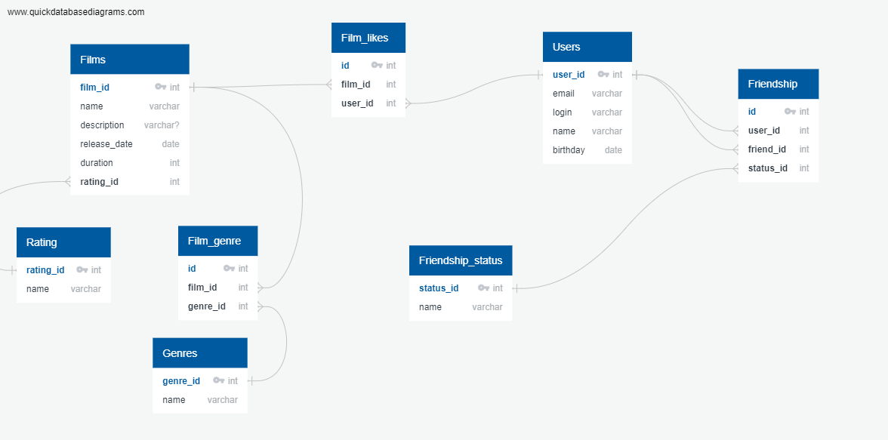

# java-filmorate
В проекте реализован бэк-энд приложения для поиска информации о фильмах, 
их оценки, поиска друзей-фильмолюбов.

Возможности:

- создание, обновление фильмов;
- возможность отметки понравившихся фильмов;
- выведение лучших фильмов (в зависимости от количества лайков);
- создание и обновление пользователей;
- добавление пользователей в друзья (друг добавляется атоматически.
и считается неподтвержденной; в случае, если друг тоже направляет
запрос на добавление в друзья - дружка считается подтвержденной);
- удаление пользователей из друзей (при подтвержденной дружбе друзья 
удаляются у обоих пользователей, при неподтвержденной - пользователь 
может удалить пользователя только из списка своих друзей)

При разработке использовался фреймворк Spring Boot и база данных H2.
Структура базы данных представлена на изображении.

Разработала Юлия Лукшина ualukshina@yandex.ru